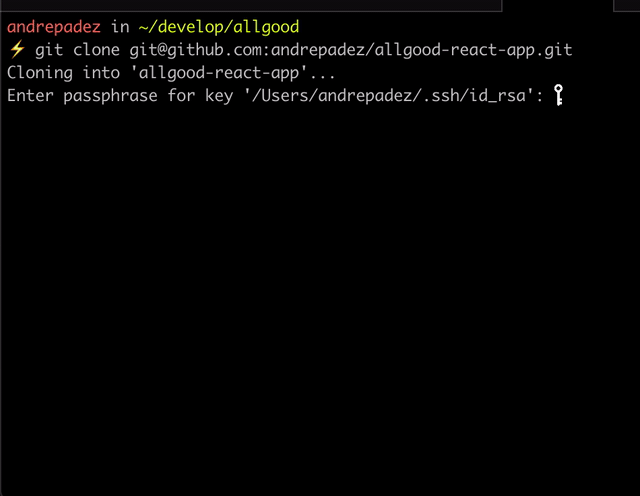

This project is a template based on [Create React App](https://github.com/facebook/create-react-app).

Fixes some of the problems I have encountered using it, hope it will work for you...



## Why?

- It's been built to work on the latest stable Node (12) and Yarn (1.19.2) versions
- has the latest versions of all it's dependencies
- clean `Yarn install` with no nasty warnings of "missing peer dependencies" or "security issues
- I'm going to check for updates on the dependencies, at least once a week, and release new versions when fit so we can always bootstrap our applications from the best starting point
- no more problems with the routing when deploying to heroku or other similar platform
- not opinionated at all, just extra work on top of `create-react-app`, but comes with my `prettierrc` settings, easy to change
- Easily set up your Environment Variables on the `.env` file
- comes with `react-router` and `node-sass` by default but plan on making it optional when i build the CLI, along with other addons that are part of my stack like `apollo-boost` `react-bootstrap` `styled-components` etc

## Instalation

- make sure you're running `node >=12` and `yarn >=1.19.2` (I recommend [n](https://www.npmjs.com/package/n) for node versioning, but you can also use [nvm](https://github.com/nvm-sh/nvm))
- I recommed running `$ yarn cache clean` before using it for the first time, but it won't be necessary unless you see warnings or errors in the install process

- I plan to build a CLI, so it will work easily as `npx allgood-react <project-name>` but for now:

```
$ git clone `git@github.com:andrepadez/allgood-react-app.git <project-name>`
$ cd <project-name>
$ yarn
$ yarn dev
```

- I changed the `start` script to `dev` so when deployed to a `PaaS`like heroku, the start command will run the server to fix all your problems with routing, so mind that when running and reading through the original documentation of `create-react-app`that i'll leave immediately below

## Available Scripts

In the project directory, you can run:

### `yarn start`

Runs the app in the development mode.<br />
Open [http://localhost:3000](http://localhost:3000) to view it in the browser.

The page will reload if you make edits.<br />
You will also see any lint errors in the console.

### `yarn test`

Launches the test runner in the interactive watch mode.<br />
See the section about [running tests](https://facebook.github.io/create-react-app/docs/running-tests) for more information.

### `yarn build`

Builds the app for production to the `build` folder.<br />
It correctly bundles React in production mode and optimizes the build for the best performance.

The build is minified and the filenames include the hashes.<br />
Your app is ready to be deployed!

See the section about [deployment](https://facebook.github.io/create-react-app/docs/deployment) for more information.

### `yarn eject`

**Note: this is a one-way operation. Once you `eject`, you can’t go back!**

If you aren’t satisfied with the build tool and configuration choices, you can `eject` at any time. This command will remove the single build dependency from your project.

Instead, it will copy all the configuration files and the transitive dependencies (Webpack, Babel, ESLint, etc) right into your project so you have full control over them. All of the commands except `eject` will still work, but they will point to the copied scripts so you can tweak them. At this point you’re on your own.

You don’t have to ever use `eject`. The curated feature set is suitable for small and middle deployments, and you shouldn’t feel obligated to use this feature. However we understand that this tool wouldn’t be useful if you couldn’t customize it when you are ready for it.

## Learn More

You can learn more in the [Create React App documentation](https://facebook.github.io/create-react-app/docs/getting-started).

To learn React, check out the [React documentation](https://reactjs.org/).

### Code Splitting

This section has moved here: https://facebook.github.io/create-react-app/docs/code-splitting

### Analyzing the Bundle Size

This section has moved here: https://facebook.github.io/create-react-app/docs/analyzing-the-bundle-size

### Making a Progressive Web App

This section has moved here: https://facebook.github.io/create-react-app/docs/making-a-progressive-web-app

### Advanced Configuration

This section has moved here: https://facebook.github.io/create-react-app/docs/advanced-configuration

### Deployment

This section has moved here: https://facebook.github.io/create-react-app/docs/deployment

### `yarn build` fails to minify

This section has moved here: https://facebook.github.io/create-react-app/docs/troubleshooting#npm-run-build-fails-to-minify
